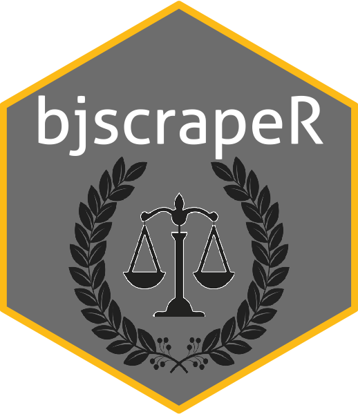

<!-- README.md is generated from README.Rmd. Please edit that file -->

# bjscrapeR 

[](https://travis-ci.com/dylanjm/bjscrapeR)
[](http://www.repostatus.org/#active)

Drawing heavy influence from
[`library(blscrapeR)`](https://github.com/keberwein/blscrapeR), this
library is meant to be a tidy wrapper around the Bureau of Justice
Statistics (BJS) API. The idea is to utilize the ‘tidyverse’ methodology
to create an efficient workflow when dealing with crime statistics.

## Installation

You can install bjscrapeR from github with:

``` r
# install.packages("devtools")
devtools::install_github("dylanjm/bjscrapeR")
```

## Basic Usage

As of right now, the package only comes with one function: `ncvs_api()`,
which queries information from the **National Crime Victimization Survey
(NCVS)**. This data comes in two forms: personal and household crime
statistics with years available from 1993-2016.

``` r
library(bjscrapeR)

crime_dat <- ncvs_api(year = 2012, dataset = "personal")
#> Trying BJS Servers...
#> Payload Successful
head(crime_dat, 5)
#> # A tibble: 5 x 23
#>    year weight gender race1R hispanic ethnic1R  ager marital2 hincome
#>   <int>  <dbl>  <int>  <int>    <int>    <int> <int>    <int>   <int>
#> 1  2012  2739.      1      1        2        1     6        3      88
#> 2  2012  2739.      1      1        2        1     6        3      88
#> 3  2012  2232.      2      2        2        2     5        1       2
#> 4  2012  1570.      2      2        2        2     6        1       2
#> 5  2012  3097.      1      1        2        1     7        2      88
#> # ... with 14 more variables: popsize <int>, region <int>, msa <int>,
#> #   direl <int>, notify <int>, weapon <int>, weapcat <int>,
#> #   newcrime <int>, newoff <int>, seriousviolent <int>, injury <int>,
#> #   treatment <int>, vicservices <int>, locationr <int>
```
